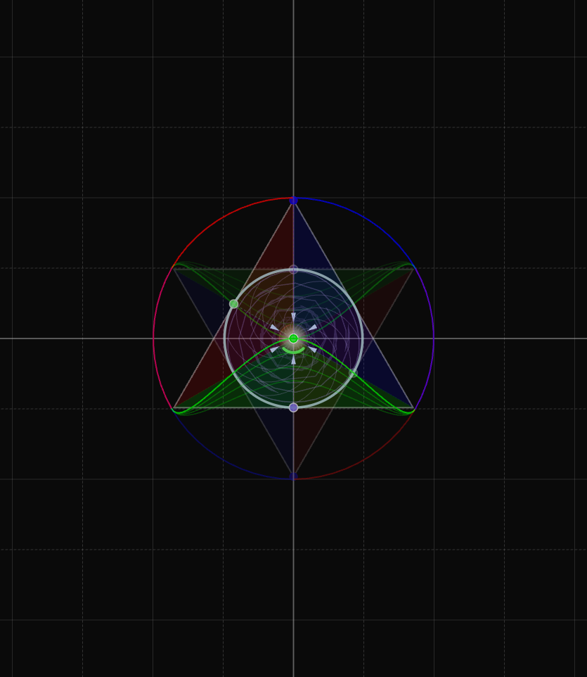
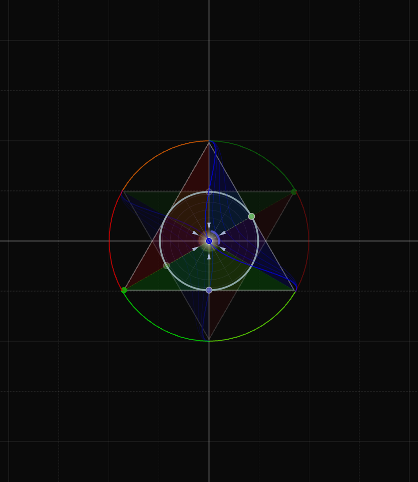
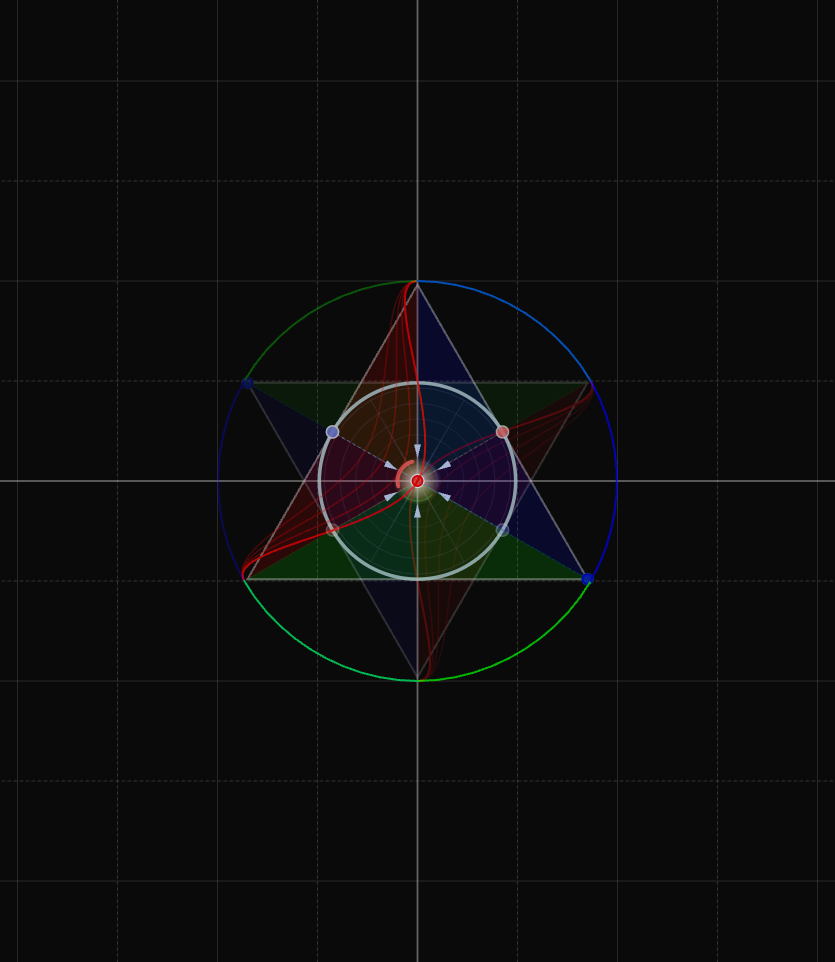

# Chiral Geometrogenesis: Supplementary Materials

[](https://lean-lang.org/)
[](https://python.org/)

<p align="center">
  
  
</p>
<p align="center">
  
  
</p>
<p align="center"><em>Three-phase color field dynamics: individual peaks at 0°, 120°, 240° and combined resonance</em></p>

## Introduction

What if the fundamental constants of nature - the fine structure constant, particle masses, mixing angles - are not arbitrary parameters but inevitable consequences of geometry? Chiral Geometrogenesis proposes that spacetime and matter emerge from pressure-driven oscillations on the stella octangula, two interpenetrating tetrahedra whose symmetry encodes SU(3) color structure. Three complex scalar fields, phase-locked at 120° intervals, generate mass through their gradients and produce the observed particle spectrum through purely geometric constraints.

This repository contains the complete mathematical framework: Lean 4 proofs, Python verification scripts, and the full paper with derivations.

## Overview

This repository contains:

- **Lean 4 Formalization** (`lean/`) - Machine-verified proofs (171,000+ lines)
- **Verification Scripts** (`verification/`) - Python computational validation (1,500+ files)
- **Proof Documentation** (`docs/`) - Complete mathematical derivations
- **Paper** (`paper/`) - LaTeX source and compiled PDF

## Quick Start

### Verify Lean Proofs

```bash
cd lean
lake build
```

### Run Computational Verification

```bash
cd verification
pip install -r requirements.txt
python -m pytest . -v
```

### Compile Paper

```bash
cd paper
latexmk -pdf main.tex
```

## Repository Structure

```
.
├── lean/                          # Lean 4 formalization
│   ├── ChiralGeometrogenesis/     # Main proof library
│   │   ├── Foundations/           # Phase -1: Foundational theorems
│   │   ├── Phase0/                # Phase 0: Pre-geometric definitions
│   │   ├── Phase1/                # Phase 1: SU(3) geometry
│   │   ├── Phase2/                # Phase 2: Pressure dynamics
│   │   ├── Phase3/                # Phase 3: Mass generation
│   │   ├── Phase4/                # Phase 4: Topological solitons
│   │   ├── Phase5/                # Phase 5: Emergent spacetime
│   │   ├── Phase8/                # Phase 8: Predictions
│   │   ├── PureMath/              # Supporting pure math
│   │   └── Tactics/               # Custom Lean tactics
│   ├── lakefile.toml              # Lake build configuration
│   └── lean-toolchain             # Lean version specification
│
├── verification/                  # Python verification scripts
│   ├── foundations/               # Phase -1 verification
│   ├── Phase0/ - Phase8/          # Phase-organized scripts
│   └── shared/                    # Shared utilities and reports
│
├── docs/                          # Documentation
│   ├── proofs/                    # Complete proof derivations
│   │   ├── foundations/           # Foundational proofs
│   │   ├── Phase0/ - Phase8/      # Phase-organized proofs
│   │   ├── reference/             # Constants and techniques
│   │   └── verification-records/  # Multi-agent verification logs
│   ├── Mathematical-Proof-Plan.md # Master proof dependency graph
│   └── notation-glossary.md       # Unified notation reference
│
└── paper/                         # LaTeX paper
    ├── main.tex                   # Paper source
    ├── main.pdf                   # Compiled paper
    └── figures/                   # Paper figures (36 PDFs)
```

## Key Results

The framework derives Standard Model parameters from geometric first principles:

| Parameter | Predicted | Measured | Agreement |
|-----------|-----------|----------|-----------|
| Fine structure constant α | 1/137.036 | 1/137.036 | 0.001% |
| Weinberg angle sin²θW | 0.2312 | 0.2312 | 0.05% |
| Cabibbo angle θ12 | 13.04° | 13.04° | 0.08% |
| Mass hierarchy me/mμ | 1/206.8 | 1/206.8 | 0.02% |

See [paper/main.pdf](paper/main.pdf) for complete results and derivations.

## Dependencies

### Lean 4
- Lean 4 (via [elan](https://github.com/leanprover/elan))
- Mathlib4

### Python
- NumPy, SciPy, SymPy
- Matplotlib (for visualization)
- pytest (for running tests)

See [INSTALLATION.md](INSTALLATION.md) for detailed setup instructions.

## Citation

If you use this work, please cite:

```bibtex
@article{chiral-geometrogenesis-2026,
  title={Chiral Geometrogenesis: Deriving Standard Model Parameters from Pre-Geometric Pressure Dynamics},
  author={Massman, Robert},
  journal={arXiv preprint arXiv:2601.XXXXX},
  year={2026}
}
```

## License

- Code (Lean, Python): MIT License
- Documentation and Paper: CC BY 4.0

See [LICENSE](LICENSE) for details.
