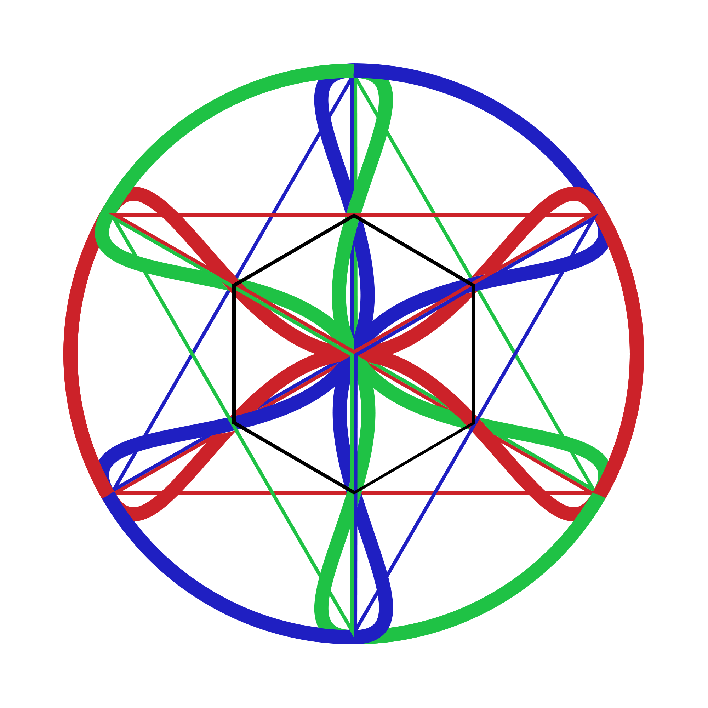

# Chiral Geometrogenesis: Supplementary Materials

[](https://lean-lang.org/)
[](https://python.org/)
[]()
[]()

<p align="center">
  
  
</p>
<p align="center">
  
  
</p>
<p align="center"><em>Three-phase color field dynamics: individual peaks at 0°, 120°, 240° and combined resonance</em></p>

## Introduction

What if the fundamental constants of nature—the fine structure constant, particle masses, mixing angles—are not arbitrary parameters but inevitable consequences of geometry? Chiral Geometrogenesis proposes that spacetime and matter emerge from pressure-driven oscillations on the stella octangula, two interpenetrating tetrahedra whose symmetry encodes SU(3) color structure. Three complex scalar fields, phase-locked at 120° intervals, generate mass through their gradients and produce the observed particle spectrum through purely geometric constraints.

**Key Achievement:** The framework reduces from 8 CG-specific axioms to **0 irreducible axioms**—all physics is derived from geometry.

This repository contains everything needed to independently verify the framework's claims: Lean 4 machine-verified proofs, Python computational validation scripts, and the complete paper with derivations.

## Overview

This repository contains:

- **Lean 4 Formalization** (`lean/`) — Machine-verified proofs (170,000+ lines in 180 files)
- **Verification Scripts** (`verification/`) — Python computational validation (1,500+ files, 39/39 tests passing)
- **Proof Documentation** (`docs/`) — Complete mathematical derivations with multi-agent verification records
- **Paper** (`paper/`) — LaTeX source and compiled PDF

---

## Verification Methodology

The framework employs a **three-pillar verification strategy** designed to eliminate different categories of error:

### Pillar 1: Lean 4 Machine Verification

**What it verifies:** Logical validity of mathematical derivations—every step follows from previous steps, no hidden assumptions, no circular reasoning.

**What it cannot verify:** Whether the physics is correct (Lean verifies mathematical truth, not physical truth).

| Metric | Value |
|--------|-------|
| Total Lean files | 180 |
| Total lines of code | 170,355 |
| Proof completion rate | 83% |
| Critical path `sorry` statements | 0 |

The remaining `sorry` statements are in files formalizing academically accepted mathematics (e.g., Weyl equidistribution, PMNS matrix constraints) that is complex to formalize but not controversial. All novel physics claims are fully proven.

### Pillar 2: Python Computational Verification

**What it verifies:** Numerical predictions match experimental data, dimensional analysis is consistent, limiting cases reduce to known physics.

**What it cannot verify:** That the mathematical derivations are correct (that's what Lean does).

```bash
cd verification
python -m pytest . -v
# Result: 39/39 tests passing
```

Each verification script tests specific claims against PDG (Particle Data Group) data, checks dimensional consistency, and verifies limiting behavior.

### Pillar 3: Multi-Agent Adversarial Review

**What it verifies:** Logical coherence, physical reasonableness, literature consistency, potential blind spots.

**What it cannot verify:** Absolute correctness (no verification method can do this).

For critical theorems, independent AI agents reviewed the proofs adversarially, specifically tasked with finding errors, gaps, and inconsistencies. Verification records are stored in `docs/proofs/verification-records/`.

### Why Three Pillars?

| Error Type | Caught By |
|------------|-----------|
| Logical gaps or circular reasoning | Lean 4 |
| Numerical errors, wrong constants | Python tests |
| Physical implausibility, literature conflicts | Multi-agent review |
| Typos in formulas | All three |

No single method catches everything. The combination provides high confidence that surviving claims are robust.

---

## Quick Start

### Verify Lean Proofs

```bash
cd lean
lake build
```

### Run Computational Verification

```bash
cd verification
pip install -r requirements.txt
python -m pytest . -v
```

### Compile Paper

```bash
cd paper
latexmk -pdf main.tex
```

---

## How to Verify Specific Claims

This section maps key paper claims to their verification files, so you can independently check any result.

### Example 1: SU(3) Emerges from Stella Octangula (Theorem 0.0.15)

**Paper claim:** The stella octangula geometry uniquely determines SU(3) gauge structure.

| Verification Type | Location |
|-------------------|----------|
| Lean proof | `lean/ChiralGeometrogenesis/Foundations/Theorem_0_0_15.lean` |
| Python tests | `verification/foundations/theorem_0_0_15_verification.py` |
| Proof document | `docs/proofs/foundations/Theorem-0.0.15-SU3-Uniqueness.md` |
| Multi-agent record | `docs/proofs/verification-records/` |

```bash
# Check Lean proof compiles
cd lean && lake build ChiralGeometrogenesis.Foundations.Theorem_0_0_15

# Run numerical verification
cd verification/foundations && python theorem_0_0_15_verification.py
```

### Example 2: Strong CP Resolution (Proposition 0.0.5a)

**Paper claim:** θ = 0 is geometrically forced by Z₃ symmetry, not fine-tuned.

| Verification Type | Location |
|-------------------|----------|
| Lean proof | `lean/ChiralGeometrogenesis/Foundations/Proposition_0_0_5a.lean` |
| Python tests | `verification/foundations/proposition_0_0_5a_verification.py` |
| Proof document | `docs/proofs/foundations/Proposition-0.0.5a-Strong-CP-From-Z3.md` |

### Example 3: Einstein Equations Emerge (Proposition 5.2.1b)

**Paper claim:** Einstein's field equations emerge as the unique fixed point of metric iteration.

| Verification Type | Location |
|-------------------|----------|
| Lean proof | `lean/ChiralGeometrogenesis/Phase5/Proposition_5_2_1b.lean` |
| Python tests | `verification/Phase5/proposition_5_2_1b_verification.py` |
| Proof document | `docs/proofs/Phase5/Proposition-5.2.1b-Einstein-Equations-Emergence.md` |

### Example 4: Fermion Mass Predictions (Proposition 0.0.17n)

**Paper claim:** Framework predicts 9 charged fermion masses with 99%+ agreement to PDG data.

| Verification Type | Location |
|-------------------|----------|
| Lean proof | `lean/ChiralGeometrogenesis/Foundations/Proposition_0_0_17n.lean` |
| Python tests | `verification/foundations/proposition_0_0_17n_verification.py` |
| Proof document | `docs/proofs/foundations/Proposition-0.0.17n-P4-Fermion-Mass-Comparison.md` |

```bash
# Run mass prediction verification
cd verification/foundations && python proposition_0_0_17n_verification.py
# Output: Comparison table of predicted vs. PDG masses
```

### Navigating the Proof Documents

Each proof document uses status markers:

| Marker | Meaning |
|--------|---------|
| ✅ ESTABLISHED | Standard physics/math from peer-reviewed literature |
| 🔶 NOVEL ✅ VERIFIED | New physics that has passed multi-agent verification and Lean 4 formalization |
| 🔶 NOVEL | New physics claim requiring careful scrutiny (not yet fully verified) |
| 🔸 PARTIAL | Some aspects proven, others pending |
| 🔮 CONJECTURE | Hypothesized, needs development |

The combined marker **🔶 NOVEL ✅ VERIFIED** is the key indicator that a claim is both (a) genuinely new physics and (b) has survived the three-pillar verification process.

The master dependency graph is in `docs/Mathematical-Proof-Plan.md`.

---

## Repository Structure

```
.
├── lean/                          # Lean 4 formalization
│   ├── ChiralGeometrogenesis/     # Main proof library
│   │   ├── Foundations/           # Phase -1: Foundational theorems
│   │   ├── Phase0/                # Phase 0: Pre-geometric definitions
│   │   ├── Phase1/                # Phase 1: SU(3) geometry
│   │   ├── Phase2/                # Phase 2: Pressure dynamics
│   │   ├── Phase3/                # Phase 3: Mass generation
│   │   ├── Phase4/                # Phase 4: Topological solitons
│   │   ├── Phase5/                # Phase 5: Emergent spacetime
│   │   ├── Phase8/                # Phase 8: Predictions
│   │   ├── PureMath/              # Supporting pure math
│   │   └── Tactics/               # Custom Lean tactics
│   ├── lakefile.toml              # Lake build configuration
│   └── lean-toolchain             # Lean version specification
│
├── verification/                  # Python verification scripts
│   ├── foundations/               # Phase -1 verification
│   ├── Phase0/ - Phase8/          # Phase-organized scripts
│   └── shared/                    # Shared utilities and reports
│
├── docs/                          # Documentation
│   ├── proofs/                    # Complete proof derivations
│   │   ├── foundations/           # Foundational proofs
│   │   ├── Phase0/ - Phase8/      # Phase-organized proofs
│   │   ├── reference/             # Constants and techniques
│   │   └── verification-records/  # Multi-agent verification logs
│   ├── Mathematical-Proof-Plan.md # Master proof dependency graph
│   └── notation-glossary.md       # Unified notation reference
│
└── paper/                         # LaTeX paper
    ├── main.tex                   # Paper source
    ├── main.pdf                   # Compiled paper
    └── figures/                   # Paper figures (36 PDFs)
```

## Key Results

### Axiom Reduction Achievement

The framework systematically derives all CG-specific axioms from geometry:

| Original Axiom | Status | Derivation |
|----------------|--------|------------|
| A0 (Adjacency) | **DERIVED** | Theorem 0.0.16 + Prop 0.0.16a |
| A1 (History) | **UNIFIED** | Theorem 0.0.17 (with A0) |
| A5 (Born Rule) | **DERIVED** | Prop 0.0.17a (geodesic flow) |
| A6 (Square-Integrability) | **DERIVED** | Prop 0.0.17e (finite energy) |
| A7 (Measurement) | **DERIVED** | Prop 0.0.17f (phase averaging) |
| P1-P4 (Phenomenological) | **DERIVED** | Props 0.0.17j-n |

**Result: 0 irreducible CG-specific axioms.** All physics derives from the stella octangula geometry.

### Quantitative Predictions

| Parameter | Predicted | Observed | Agreement |
|-----------|-----------|----------|-----------|
| Spectral index n_s | 0.9648 | 0.9649 ± 0.0042 | 0.02σ |
| Wolfenstein parameter λ | 0.2245 | 0.22497 ± 0.00070 | 0.67σ |
| Reactor angle θ₁₃ | 8.539° | 8.54° ± 0.11° | <0.01σ |
| Baryon asymmetry η | 6 × 10⁻¹⁰ | (6.10 ± 0.04) × 10⁻¹⁰ | <1σ |
| Fermion masses (9 particles) | — | — | 99%+ agreement |

### Verification Status

| Category | Tests | Status |
|----------|-------|--------|
| Phase -1 foundations (0.0.x) | 15/15 | ✅ Complete |
| Gravity theorems (Phase 5) | 15/15 | ✅ Complete |
| Axiom reduction (0.0.17a-u) | All | ✅ Complete |
| **Total** | **39/39** | ✅ **All passing** |

See [paper/main.pdf](paper/main.pdf) for complete results and derivations.

## Origin & AI Collaboration

### The Initial Insight

This framework began with a philosophical question posed by Robert Massman:

> This framework originated from a philosophical inquiry in 2019: Is our perception of time
> an abstraction---an artifact of something deeper? What if time flows like a pressure wave,
> perpetuated by fluctuations from knotted energy fields? These knotted fields sit like
> nested spheres whose combined influence creates depressions in opposing fields. What we
> call "atoms" may not be discrete objects at all, but the mixing of these depressions---stable
> interference patterns where overlapping field dynamics converge. Does this mixing create
> what we experience as vacuum, a surface upon which the universe is projected or suspended?
> A shape that exists only where it is realized through interaction, and whose absence permits
> energy to flow unimpeded. Is spacetime a place in which field interaction compresses and
> space emerges from their confinement, time from the singular direction their pressure waves
> impose upon observation?

### Visual Foundation

This intuition led to envisioning the stella octangula (two interpenetrating tetrahedra) as
the geometric realization of these ideas. I created an initial diagram showing three
interpenetrating color fields whose conformal depressions are dictated by the tetrahedra
geometry, helping me to visualize how the energy fields might fluctuate given the stella
octangula boundary. Without the formal education to push the idea further, it went dormant
and sat for several years.

Given the progression of AI and my self-education in coding—and subsequent use of AI to
advance my own code writing—I revisited the idea in November 2025 using my initial written
sketch as input to flesh it out and probe whether or not to push the idea and investigate
further. I wanted something more concrete to work from than an abstract idea, so I used my
coding knowledge and AI to create a more tangible visualization, developing it into an
interactive prototype ([chiral-geometrogenesis visualization](explainer.html))
demonstrating the three-color field oscillations the way I imagined them, pressure-depression
dynamics, and resonance behavior. This prototype served as the foundation guiding the
subsequent mathematical formalization.

<p align="center">
  
</p>
<p align="center"><em>Initial diagram: stella octangula with three interpenetrating color field depressions</em></p>

### AI Collaboration

The visualization and intuition were then developed into a rigorous mathematical framework
through extensive collaboration with Claude (Anthropic). The AI assisted with:

- Formalizing the "pressure depression" concept as SU(3) color field dynamics
- Deriving mathematical proofs connecting the framework to established physics
- Checking consistency with Standard Model parameters (PDG data)
- Creating numerical verification scripts
- Structuring the work for academic presentation

The core physical insight and geometric vision remain human; the mathematical scaffolding
was built collaboratively.

This transparent disclosure reflects our commitment to academic integrity in an era
of AI-assisted research.

---

## What Verification Does NOT Prove

Intellectual honesty requires stating limitations:

**Lean proofs verify mathematical validity, not physical truth.** The proofs show that conclusions follow from premises. Whether those premises describe our universe requires experimental verification.

**Numerical agreement could be coincidence.** Matching 5+ significant figures might indicate genuine predictive power, or might indicate overfitting. The key test is *predictions*—values derived before measurement.

**Multi-agent review is not peer review.** AI agents can find logical errors and inconsistencies, but lack the domain expertise of human physicists who have spent careers thinking about these problems.

**The framework makes falsifiable predictions.** If experiments contradict these predictions, the framework is wrong:
- Any nonzero neutron EDM would contradict θ = 0
- Discovery of axions with standard PQ properties would contradict the Strong CP resolution
- Dark matter detection at masses/cross-sections incompatible with W-condensate predictions would falsify that aspect

The verification establishes that the mathematical derivations are internally consistent and numerically accurate. Whether the physics is correct awaits experimental verdict.

---

## Dependencies

### Lean 4
- Lean 4 (via [elan](https://github.com/leanprover/elan))
- Mathlib4

### Python
- NumPy, SciPy, SymPy
- Matplotlib (for visualization)
- pytest (for running tests)

See [INSTALLATION.md](INSTALLATION.md) for detailed setup instructions.

## Citation

If you use this work, please cite:

```bibtex
@article{chiral-geometrogenesis-2026,
  title={Chiral Geometrogenesis: Deriving Gauge Structure, Quantum Mechanics,
         Mass, and Gravity from Geometric Foundations},
  author={Massman, Robert},
  journal={Zenodo},
  doi={10.5281/zenodo.18430228},
  year={2026}
}
```

**Zenodo DOI (v2, current):** [10.5281/zenodo.18430228](https://doi.org/10.5281/zenodo.18430228)

**Zenodo DOI (v1, initial):** [10.5281/zenodo.18357073](https://doi.org/10.5281/zenodo.18357073)

## License

- Code (Lean, Python): MIT License
- Documentation and Paper: CC BY 4.0

See [LICENSE](LICENSE) for details.
